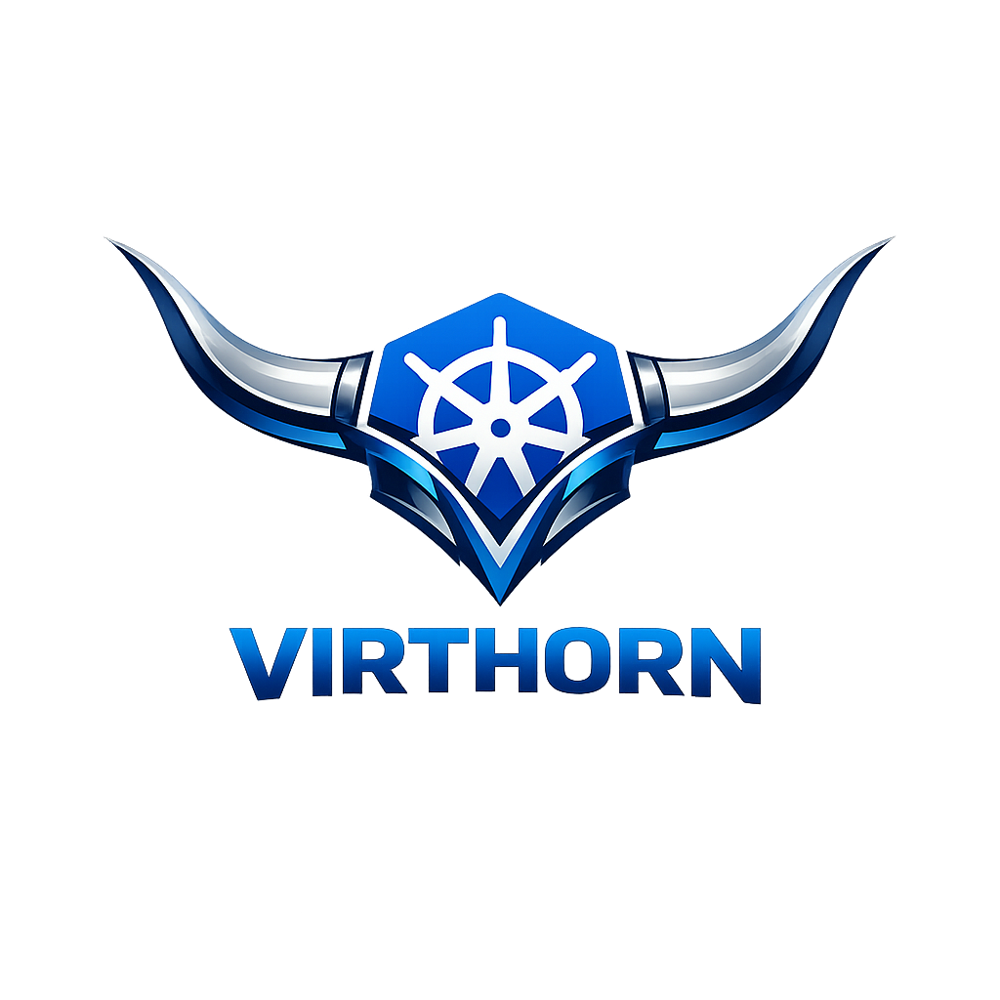

<div align="center">
  

  # virthorn-scheduler

  **A custom Kubernetes scheduler that co-locates KubeVirt VM pods with their Longhorn RWX share-manager pods — eliminating cross-node NFS traffic.**

  [](https://github.com/michaeltrip/virthorn-scheduler/actions/workflows/ci.yaml)
  [](https://github.com/michaeltrip/virthorn-scheduler/actions/workflows/release.yaml)
  [](https://goreportcard.com/report/github.com/michaeltrip/virthorn-scheduler)
  [](https://go.dev/)
  [](LICENSE)
  [](https://github.com/michaeltrip/virthorn-scheduler/pkgs/container/virthorn-scheduler)
  [](https://kubernetes.io/)
  [](https://kubevirt.io/)
  [](https://longhorn.io/)
</div>

---

## Problem

When KubeVirt VMs use Longhorn RWX volumes, Longhorn creates a `share-manager` pod (NFS server) per PVC in the `longhorn-system` namespace. By default this pod is scheduled independently of the VM, causing NFS traffic to cross node boundaries — adding latency and network overhead.

## Solution

`virthorn-scheduler` is a custom Kubernetes scheduler built with the [Scheduling Framework](https://kubernetes.io/docs/concepts/scheduling-eviction/scheduling-framework/). It implements two extension points:

| Plugin | Behaviour |
|---|---|
| **Filter** | If a share-manager is assigned for the VM's PVC, only the node where it runs passes the filter |
| **Score** | The share-manager's node receives the maximum score (100); all others receive 0 |

The scheduler is **opt-in** via a pod annotation — only pods that explicitly request it are affected.

## How It Works

```
VM Pod created
  │
  ├─ No annotation → default scheduling (no-op)
  │
  ├─ Migration target pod (kubevirt.io/migrationJobUID set)
  │    └─ Plugin is a no-op — KubeVirt migration controller
  │       handles node selection via node affinity
  │
  └─ annotation scheduler.virthorn-scheduler.io/co-schedule: "true"
       │
       ├─ No share-manager found yet
       │    └─ VM schedules freely on best node
       │
       └─ Share-manager assigned to node-X
            └─ Filter: only node-X passes
               Score: node-X gets score 100
               → VM scheduled on node-X (co-located)
```

### Share-manager node discovery

The plugin resolves the target node using two methods, in order:

1. **ShareManager CRD** (`sharemanagers.longhorn.io/v1beta2`, `status.ownerID`) — Longhorn sets this field as soon as it assigns the share-manager to a node, **before** the share-manager pod starts. This avoids the chicken-and-egg problem where the pod hasn't started yet when the VM is being scheduled.

2. **Share-manager pod** (fallback) — if the CRD lookup yields nothing, the plugin checks whether the `share-manager-<pv-name>` pod in `longhorn-system` is in `Running` phase.

### Live migration

When `virtctl migrate` is used, KubeVirt creates a new **target virt-launcher pod** and sets the label `kubevirt.io/migrationJobUID` on it. The plugin detects this label and becomes a **no-op** for migration target pods — the KubeVirt migration controller already selects the destination node via pod node affinity, and constraining it to the share-manager node would break migration.

## Installation

### 1. Build and push the image

```bash
docker build -t ghcr.io/<your-org>/virthorn-scheduler:latest .
docker push ghcr.io/<your-org>/virthorn-scheduler:latest
```

Update the `image:` field in [`manifests/deployment.yaml`](manifests/deployment.yaml) to match.

### 2. Apply the manifests

```bash
kubectl apply -f manifests/rbac.yaml
kubectl apply -f manifests/scheduler-config.yaml
kubectl apply -f manifests/deployment.yaml
```

### 3. Verify the scheduler is running

```bash
kubectl -n kube-system get pods -l app=virthorn-scheduler
```

## Usage

### Opt-in a VirtualMachine

Add the annotation and set `schedulerName` in your `VirtualMachine` spec:

```yaml
apiVersion: kubevirt.io/v1
kind: VirtualMachine
metadata:
  name: my-vm
spec:
  template:
    metadata:
      annotations:
        scheduler.virthorn-scheduler.io/co-schedule: "true"   # opt-in to co-scheduling
    spec:
      schedulerName: virthorn-scheduler           # use our custom scheduler
      domain:
        # ... your VM spec ...
      volumes:
        - name: datavol
          persistentVolumeClaim:
            claimName: my-rwx-pvc                # must be a Longhorn RWX PVC
```

KubeVirt propagates annotations from the `VirtualMachine` template to the `virt-launcher` pod automatically.

### How share-manager pods are discovered

Longhorn names share-manager pods after the **PV name** (which equals the PVC UID for dynamically provisioned volumes):

```
longhorn-system/share-manager-pvc-<uuid>
```

The plugin:
1. Lists all PVCs referenced by the VM pod
2. Checks each PVC is `ReadWriteMany`
3. Resolves the PV name from `pvc.spec.volumeName`
4. Queries the `ShareManager` CRD (`sharemanagers.longhorn.io`) for `status.ownerID` — the node assigned by Longhorn
5. Falls back to checking the `share-manager-<pv-name>` pod phase if the CRD yields nothing
6. Uses the resolved node for Filter/Score

### Live migration behaviour

Migration target pods are identified by the label `kubevirt.io/migrationJobUID` (set by KubeVirt to the UID of the `VirtualMachineInstanceMigration` object). The plugin skips both Filter and Score for these pods, allowing the KubeVirt migration controller to place the target pod freely.

## Configuration

| Item | Value |
|---|---|
| Opt-in annotation key | `scheduler.virthorn-scheduler.io/co-schedule` |
| Opt-in annotation value | `true` |
| Scheduler name | `virthorn-scheduler` |
| Share-manager namespace | `longhorn-system` |
| ShareManager CRD | `sharemanagers.longhorn.io/v1beta2` |
| Share-manager pod name pattern | `share-manager-<pv-name>` |
| Migration target label | `kubevirt.io/migrationJobUID` |

## Debugging / Logging

The plugin emits structured log messages using `klog` at verbosity level **4** (`V(4)`). The default deployment ships with `--v=4` so plugin decisions are visible out of the box.

### Enabling / changing verbosity

The verbosity flag is set in [`manifests/deployment.yaml`](manifests/deployment.yaml):

```yaml
command:
  - /virthorn-scheduler
  - --config=/etc/kubernetes/scheduler/scheduler-config.yaml
  - --v=4   # change to 2 for quieter output, 5 for trace-level
```

To change it on a running cluster without redeploying:

```bash
kubectl -n kube-system patch deployment virthorn-scheduler --type=json \
  -p='[{"op":"replace","path":"/spec/template/spec/containers/0/command/2","value":"--v=4"}]'
```

### What gets logged

| Verbosity | Message |
|---|---|
| `V(4)` | Migration target pod detected — plugin skipped (includes `migrationJobUID`) |
| `V(4)` | No share-manager found — all nodes pass / score 0 |
| `V(4)` | Node accepted — share-manager co-located on same node |
| `V(4)` | Node rejected — share-manager on a different node |
| `V(4)` | Score assigned — max (100) or 0, with reason |
| `V(5)` | Pod not opted in — plugin skipped |
| `ErrorS` | Share-manager lookup failed (API error) |

### Example log output

**VM scheduled on share-manager node:**
```
LonghornCoSchedule/Filter: node accepted (share-manager co-located)  pod=virtualmachines/virt-launcher-my-vm-xxxxx node=virt01 shareManagerNode=virt01
LonghornCoSchedule/Score: node matches share-manager, scoring max    pod=... node=virt01 shareManagerNode=virt01 score=100
LonghornCoSchedule/Score: node does not match share-manager, scoring 0  pod=... node=virt02 shareManagerNode=virt01
```

**Node rejected (wrong node):**
```
LonghornCoSchedule/Filter: node rejected (share-manager on different node)  pod=... node=virt02 shareManagerNode=virt01
```

**Live migration target (plugin bypassed):**
```
LonghornCoSchedule/Filter: migration target pod, skipping (KubeVirt migration controller handles placement)  pod=... migrationJobUID=08b02237-4ab6-493b-a4e0-c90e5e940a47
LonghornCoSchedule/Score: migration target pod, skipping (KubeVirt migration controller handles placement)   pod=... node=virt02 migrationJobUID=08b02237-4ab6-493b-a4e0-c90e5e940a47
```

**No share-manager yet (free scheduling):**
```
LonghornCoSchedule/Filter: no share-manager found, all nodes pass  pod=... node=virt01
LonghornCoSchedule/Score: no share-manager found, scoring 0        pod=... node=virt01
```

### Tailing the scheduler logs

```bash
kubectl -n kube-system logs -l app=virthorn-scheduler -f | grep LonghornCoSchedule
```

## Development

### Prerequisites

- Go 1.24+
- Access to a Kubernetes cluster with KubeVirt and Longhorn installed

### Build

```bash
go build -o virthorn-scheduler ./cmd/scheduler
```

### Test

```bash
go test ./pkg/...
```

### Project Structure

```
virthorn-scheduler/
├── cmd/scheduler/main.go                        # Entry point
├── pkg/plugins/longhorn_cosched/
│   ├── plugin.go                                # Plugin registration, constants & helpers
│   ├── filter.go                                # Filter extension point
│   ├── score.go                                 # Score extension point
│   ├── sharemanager.go                          # ShareManager CRD + pod lookup
│   └── plugin_test.go                           # Unit tests
├── manifests/
│   ├── rbac.yaml                                # RBAC permissions
│   ├── scheduler-config.yaml                    # KubeSchedulerConfiguration
│   └── deployment.yaml                          # Scheduler Deployment
└── Dockerfile
```

## License

See [LICENSE](LICENSE).
