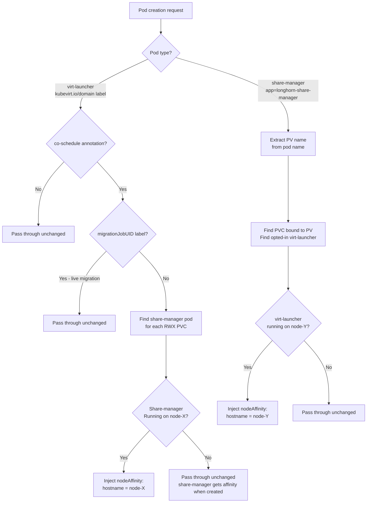
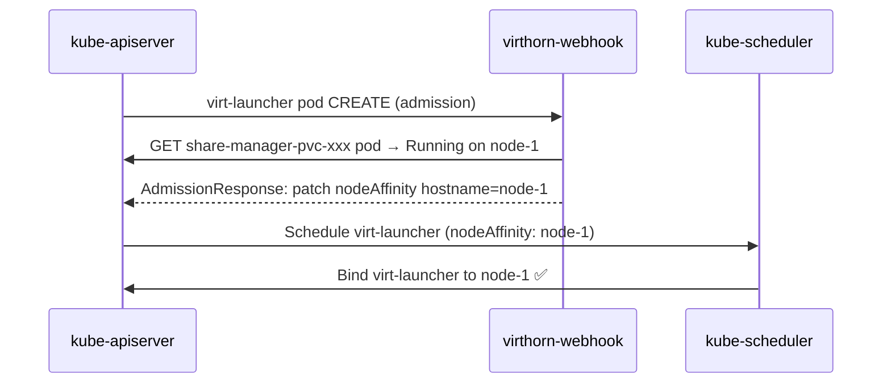
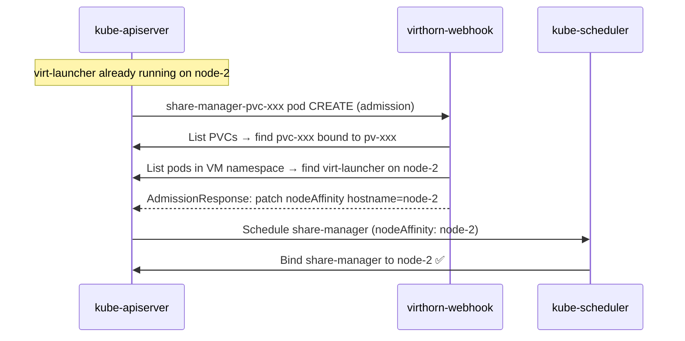
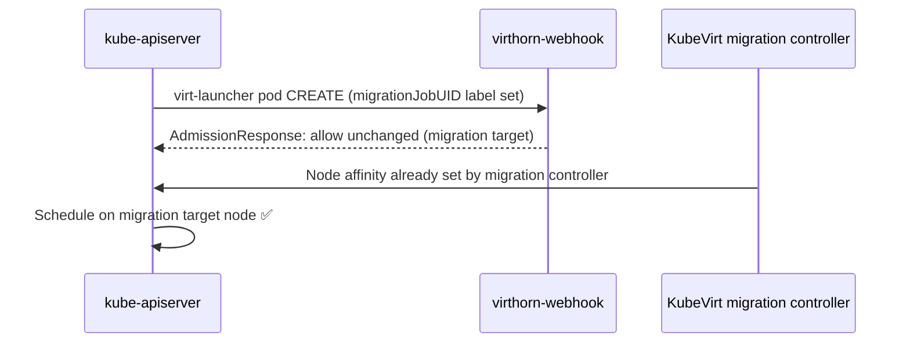

# VirtHorn Scheduler — Architecture Plan (Webhook Edition)

## Problem Statement

When KubeVirt VMs use **Longhorn RWX** volumes, Longhorn creates a `share-manager` pod that serves an NFS share for that PVC. By default, this share-manager pod is scheduled independently of the VM pod, meaning the VM's NFS traffic crosses node boundaries — adding latency and network overhead.

**Goal:** Co-schedule the VM pod and its Longhorn share-manager pod on the **same node**, using a Kubernetes mutating admission webhook with an opt-in annotation.

---

## Why Not a Custom Scheduler Plugin?

The original approach used a custom `kube-scheduler` plugin (Filter + Score extension points). This was abandoned because:

1. **Cold start was unreliable**: When a PVC has never been attached, `spec.nodeID` on the Longhorn Volume CRD is empty. The plugin attempted a "replica heuristic" — guessing the attachment node from Longhorn Replica CRDs — but Longhorn does not guarantee this behavior, making it unreliable.

2. **PostBind was never implemented**: The architecture plan described a PostBind plugin that would write `spec.nodeID` back to the Longhorn Volume CRD after cold-start scheduling. This was never implemented, so cold starts were never fixed.

3. **Massive dependency**: Embedding `k8s.io/kubernetes` (the full scheduler framework) added enormous build complexity and dependency management overhead.

---

## Solution: Mutating Admission Webhook

A **mutating admission webhook** intercepts pod creation requests and injects `nodeAffinity` rules directly into the pod spec before the scheduler sees it. The standard `kube-scheduler` then honors the injected affinity — no custom scheduler binary needed.

### Why This Works

- **Bidirectional**: whichever pod (virt-launcher or share-manager) is created second gets affinity pointing to the first
- **Reliable**: uses Kubernetes native nodeAffinity — no guessing, no CRD heuristics
- **Fail-open**: `failurePolicy: Ignore` means pods are admitted normally if the webhook is unavailable
- **Simple**: no `k8s.io/kubernetes` dependency, no scheduler config YAML

---

## Architecture



---

## Key Design Decisions

### 1. Opt-in Annotation
```
scheduler.virthorn-scheduler.io/co-schedule: "true"
```
Applied to the KubeVirt `VirtualMachine` spec.template.metadata.annotations. KubeVirt propagates annotations from the VM spec to the virt-launcher pod automatically.

### 2. No Custom schedulerName
The standard `kube-scheduler` is used. No `spec.schedulerName: virthorn-scheduler` is needed. The webhook injects affinity before the scheduler runs.

### 3. Bidirectional Webhook Targeting

| Pod type | Namespace | Detection | Action |
|---|---|---|---|
| `virt-launcher-*` | any | `kubevirt.io/domain` label | Inject affinity → share-manager node |
| `share-manager-*` | `longhorn-system` | `app=longhorn-share-manager` label | Inject affinity → virt-launcher node |

### 4. Live Migration Skip
When `virtctl migrate` is used, KubeVirt sets `kubevirt.io/migrationJobUID` on the target virt-launcher pod. The webhook detects this label and passes the pod through unchanged — the KubeVirt migration controller handles node selection via node affinity.

### 5. Fail-Open
`failurePolicy: Ignore` in the `MutatingWebhookConfiguration` ensures that if the webhook server is unavailable, pods are admitted normally. VMs may temporarily land on the wrong node, but the cluster never gets stuck.

### 6. TLS Bootstrap (No cert-manager)
The webhook server generates a self-signed CA + server certificate at startup, stores it in a Kubernetes Secret (`kube-system/virthorn-webhook-tls`), and patches the `caBundle` field in the `MutatingWebhookConfiguration`. No external dependency required.

---

## Project Structure

```
virthorn-scheduler/
├── cmd/
│   └── webhook/
│       └── main.go              # Entry point — HTTPS server, /mutate + /healthz
├── pkg/
│   └── webhook/
│       ├── handler.go           # Webhook logic — pod detection, affinity injection
│       └── tls.go               # Self-signed TLS bootstrap
├── manifests/
│   ├── rbac.yaml                # ServiceAccount, ClusterRole, Role, bindings
│   ├── webhook.yaml             # MutatingWebhookConfiguration + Service
│   └── webhook-deployment.yaml  # Deployment + ServiceAccount
├── Dockerfile
├── go.mod
├── go.sum
├── LICENSE
└── README.md
```

---

## Go Module Dependencies

| Dependency | Purpose |
|---|---|
| `k8s.io/api` | Kubernetes API types (Pod, PVC, Affinity, AdmissionReview) |
| `k8s.io/apimachinery` | API machinery utilities (types, meta) |
| `k8s.io/client-go` | Kubernetes API client |
| `k8s.io/klog/v2` | Structured logging |

No `k8s.io/kubernetes` dependency — the full scheduler framework is not needed.

---

## RBAC Requirements

| Resource | Verbs | Reason |
|---|---|---|
| `pods` (all namespaces) | `get`, `list`, `watch` | Find virt-launcher pods using a PVC |
| `persistentvolumeclaims` (all namespaces) | `get`, `list`, `watch` | Resolve PVC → PV name, check RWX |
| `secrets` (kube-system) | `get`, `create`, `update` | Store self-signed TLS cert |
| `mutatingwebhookconfigurations` | `get`, `patch` | Patch caBundle at startup |

---

## Webhook Configuration

```yaml
apiVersion: admissionregistration.k8s.io/v1
kind: MutatingWebhookConfiguration
metadata:
  name: virthorn-webhook
webhooks:
  # Rule 1: virt-launcher pods (any namespace)
  - name: virt-launcher.virthorn-webhook.io
    failurePolicy: Ignore
    objectSelector:
      matchExpressions:
        - key: kubevirt.io/domain
          operator: Exists
    rules:
      - operations: ["CREATE"]
        resources: ["pods"]

  # Rule 2: share-manager pods (longhorn-system only)
  - name: share-manager.virthorn-webhook.io
    failurePolicy: Ignore
    namespaceSelector:
      matchLabels:
        kubernetes.io/metadata.name: longhorn-system
    objectSelector:
      matchExpressions:
        - key: app
          operator: In
          values: ["longhorn-share-manager"]
    rules:
      - operations: ["CREATE"]
        resources: ["pods"]
```

---

## VM Usage Example

```yaml
apiVersion: kubevirt.io/v1
kind: VirtualMachine
metadata:
  name: my-vm
spec:
  template:
    metadata:
      annotations:
        scheduler.virthorn-scheduler.io/co-schedule: "true"   # opt-in
    spec:
      # No schedulerName needed — use default kube-scheduler
      volumes:
        - name: datavol
          persistentVolumeClaim:
            claimName: my-rwx-pvc
```

---

## Sequence Diagrams

### VM starts after share-manager is already running (warm restart)



### Share-manager created after VM is already running (cold start)



### Live migration (webhook bypassed)



---

## Implementation Notes

### nodeAffinity vs podAffinity

`nodeAffinity` (matching `kubernetes.io/hostname`) is used instead of `podAffinity` (matching another pod's labels) because:
- It is simpler and more direct — no need to match pod labels
- It works even if the target pod has been deleted and recreated
- It avoids circular affinity issues between the two pod types

### Existing affinity preservation

When injecting `nodeAffinity`, any existing `podAffinity` or `podAntiAffinity` rules on the pod are preserved. Only the `nodeAffinity` field is overwritten.

### Share-manager pod name format

Longhorn names share-manager pods after the **PV name** (which equals the PVC UID for dynamically provisioned volumes):
```
longhorn-system/share-manager-pvc-<uuid>
```
The webhook extracts the PV name by stripping the `share-manager-` prefix from the pod name.
